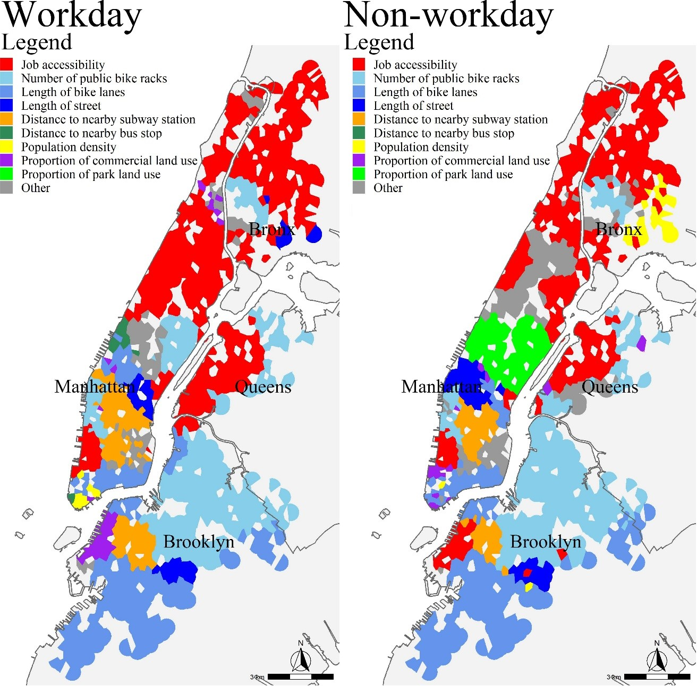
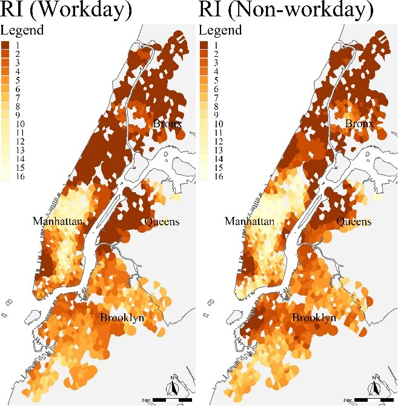
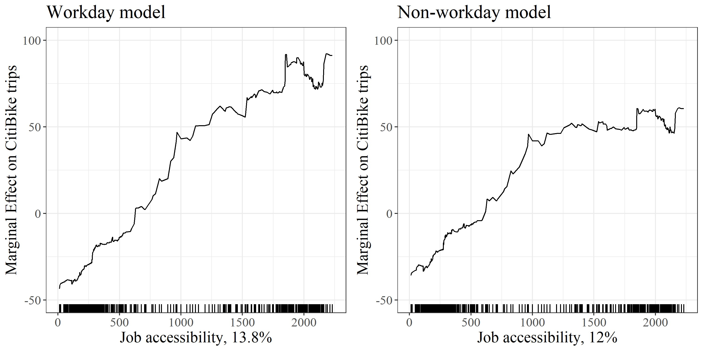

```{r setup, include = FALSE}
knitr::opts_chunk$set(eval = FALSE)
```
This code utilized geographically weighted gradient boosting decision tree (GW-GBDT) approach to estimate the spatial contributions of built environment attributes on bike sharing usage. The method integrates spatial weights into the GBDT model, combining function from both the `gbm` and `GWmodel` packages.

The core idea is to add spatial weights into each local GBDT model. By analyzing the results across all local models, we can quantify and visualize the spatial heterogeneity in the effects of built environment features.

The workflow includes the following steps:

1.  Construct local GBDT models

2.  Evaluate model performance

3.  Calculate and visualize the relative importance

4.  Estimate Accumulated Local Effects (ALE)

# Package and data

```{r}
## load the package
library(tidyverse)
library(gbm)
library(GWmodel)
library(foreach)
library(doParallel)
library(ggplot2)
```

```{r}
## load the dataset
bikedata <- read.csv("F:/R/2025/data/bikedata.csv")
```

# 1. Modelling

First, we calculated the spatial weight matrix, which is based on the assumption that the observed bike station *j* ($j \in [1, N]$, where $N$ is the total number of bike stations, i.e., the sample size) exerts a stronger influence as it is spatially closer to bike station *i* ($i \in [1, N]$).

The spatial weight function is defined as follows in Equation (1):

$$
w_{ij} = 
\begin{cases}
\left[1 - \left(\frac{d_{ij}}{b_{ik}}\right)^2 \right]^2, & d_{ij} < b_{ik} \\\\
0, & d_{ij} \geq b_{ik}
\end{cases}
\tag{1}
$$

where: - $w_{ij}$ is the spatial weight between stations *i* and *j*;\
- $d_{ij}$ is the distance between bike sharing stations *i* and *j*;\
- $b_{ik}$ is the adaptive bandwidth, defined as the distance from station *i* to its *k*-th nearest neighbor, selected via a cross-validation approach.

```{r}
# Convert the 'bikedata' data frame into a spatial object by assigning coordinates (x, y)
coordinates(bikedata) = ~x+y

# Define the regression formula
# 'Count' is the dependent variable; others are independent variables
formula = Count ~ 
  density+Proportion_of_commercial+Proportion_of_parks+
  Proportion_of_residence+
  bikerack+bikeroad+street+stationnum+
  busdistance_km+subwaydistance_km+
  w_c000_17+
  total_male+total_income+total_labor+total_senior+total_young

# Determine the bandwidth for GW-GBDT
bandwidth <- bw.gwr(formula, 
              data = sp_bikedata,
              kernel = "bisquare",
              approach = "CV",
              adaptive = T)

```

Then, we included the weight into the training process of GBDT

The `foreach` and `doParallel` package are used for parallel computation. Utilizing more CPU cores and having more memory will result in faster computation. Please adjust the parameters according to the capabilities of your device.

```{r}
numCores <- detectCores()
cl <- makeCluster(numCores-1)
registerDoParallel(cl)
b_time = Sys.time()
set.seed(2025)

# Perform the parallel computation
results <- foreach(i = 1:nrow(bikedata),  
                   .packages = c("gbm", "GWmodel"),
                   .export = c("bandwidth","bikedata")
                   ) %dopar% {
                     
  # Compute distances from the i-th location to all other points
  vdist <- gw.dist(dp.locat = cbind(bikedata$x, bikedata$y), focus = i)
  # Calculate spatial weights for the i-th location
  bikedata$weight <- gw.weight(
    vdist, 
    bw = bandwidth, 
    kernel = 'bisquare', 
    adaptive = TRUE
    )
  # Fit a local GBM model for the i-th point using spatial weights
  gbm1 <- gbm(
    Count ~ 
      density+Proportion_of_commercial+Proportion_of_parks+
      Proportion_of_residence+
      bikerack+bikeroad+street+stationnum+
      busdistance_km+subwaydistance_km+
      w_c000_17+
      total_male+total_income+total_labor+total_senior+total_young,
    weights = bikedata$weight,
    distribution = 'gaussian',
    data = data,
    n.trees = 3000,
    interaction.depth = 9,
    shrinkage = 0.001,
    cv.folds = 5)
  
  file_name <- paste0("result/GWGBDT/model/gbm_model", i, ".rds")
  saveRDS(gbm1, file_name)
}

# Stop the parallel backend
stopCluster(cl)
e_time = Sys.time()
print(e_time-b_time)
```

# 2. Evaluate model performance

This section calculates the average performance metrics across all local models, including R², MAE, and RMSE.

```{r}
r2_table <- data.frame(ModelIndex = integer(), 
                       R2 = numeric(),
                       mae= numeric(),
                       rmse= numeric())
# Loop through each local GBM model
for (i in 1:nrow(bikedata)) {
  file_name <- paste0("result/GWGBDT/model/gbm_model", i, ".rds")
  dri_gbm <- readRDS(file = file_name)
  best_iter = gbm.perf(dri_gbm, method = 'cv', plot.it = FALSE)
  train_pred <- predict(dri_gbm, bikedata, n.trees = best_iter, type = "response")
  train_r2 <- 1 - sum((bikedata$Count - train_pred)^2) / sum((bikedata$Count - mean(bikes1$Count))^2)
  train_mae <- mean(abs(bikedata$Count - train_pred))
  train_rmse <- sqrt(mean((bikedata$Count - train_pred)^2))
  r2_table <- rbind(r2_table, data.frame(ModelIndex = i,R2 = train_r2,mae=train_mae,rmse=train_rmse))
  print(i)
}
# Calculate and print the average performance across all local models
mean(r2_table$R2)#0.9282436
mean(r2_table$mae)#11.8789
mean(r2_table$rmse)#17.63087
```

# 3. Calculate and visualize the relative importance

This section organizes the Relative Importance (RI) results. First, the RI values from all local models are aggregated into one table. Then, for each local model, the most important variable is identified. The average Relative Importance (RI) of each variable across all local models is used as the RI for the global model.

```{r}
for (i in 1:nrow(bikedata)) {
  file_name <- paste0("result/GWGBDT/model/gbm_model", i, ".rds")
  dri_gbm <- readRDS(file = file_name)
  best_iter = gbm.perf(dri_gbm, method = 'cv', plot.it = F)
  
  gbmsum = summary(dri_gbm, n.trees = best_iter, plotit = F)
  importance_df =gbmsum%>%
    rename(Feature = var,
           Importance = rel.inf)%>%
    mutate(Rank = rank(-Importance))
  file_name1 <- paste0("result/work/importancework", i, ".csv")
  write.csv(importance_df,file = file_name1, row.names = FALSE)
  print(i)
}
file_list <- paste0("result/work/importancework", 1:nrow(bikedata), ".csv")
importance_list <- map(1:nrow(bikedata), ~ {
  read_csv(file_list[.x]) %>%
    select(Feature, Importance) %>%
    rename(!!paste0("Importance_", .x) := Importance)
})
df <- reduce(importance_list, full_join, by = "Feature")
dft <- df %>%
  t() %>%
  as.data.frame()
colnames(dft) <- as.character(dft[1, ])
dft <- dft[-1, ]
dft <- rownames_to_column(dft, var = "station_id")
dft$station_id <- bikedata$station_id
dft$max_column <- 1
dft$max_column <- as.character(dft$max_column)

#calculate the most important variable
variables_to_compare<- c( "density",
                          "Proportion_of_commercial",
                          "Proportion_of_parks",
                          "Proportion_of_residence",
                          "bikerack",
                          "bikeroad",
                          "street",
                          "stationnum",
                          "busdistance_km",
                          "subwaydistance_km",
                          "w_c000_17",
                          "total_male",
                          "total_income",
                          "total_labor","total_senior","total_young")
dftt <- dft %>%
  mutate_at(vars(all_of(variables_to_compare)), as.numeric)
for (i in 1:nrow(bikedata)) {
  row_data <- dftt[i, variables_to_compare]
  max_column_index <- which.max(row_data)
  max_column <- colnames(row_data)[max_column_index]
  dftt$max_column[i] <- as.character(max_column)
}
write.csv(dftt,"gwgbdt/workday/dftt_modelwork.csv", row.names = F)

#average RI
dftt=dftt%>%
  select(- max_column)
mean=colMeans(dftt)
mean=as.data.frame(mean)
write.csv(mean,"gwgbdt/workday/meanwork.csv", row.names = T)
```

The spatial variation of Relative Importance (RI) can be visualized using the `ggplot2` package together with shapefile (.shp) data. Various visualization methods can be applied to the processed RI data, please choose the one that best suits the goals of your research.

```{r}
ggplot() +
  geom_sf(data = NYC, fill = "gray95") +
  geom_sf(data = sf_points,aes(fill = name),color = NA) +
  scale_fill_manual(values = color_palette) +
  geom_sf(data = NYCB,fill = "transparent", color = "gray40",linewidth = 0.65)+
  coord_sf(xlim = c(-74.05, -73.88),
           ylim = c(40.64, 40.88)) +
  theme(text = element_text(family = "serif", size = 20),
        panel.background = element_blank(),
        axis.ticks = element_blank(),
        axis.text.x = element_blank(),
        axis.text.y = element_blank(),
        legend.position = "left",
        legend.justification = c(0, 1),
        legend.box.just = "left",
        plot.title = element_text(size = 35,hjust = 0.5)) +
  labs(title = "Spatial distribution of the most important variable", 
       fill = "")+
  annotation_scale(location = "br") +
  #
  annotation_north_arrow(location = "tl", which_north = "true",
                         style = north_arrow_fancy_orienteering)
```



```{r}
ggplot() +
  geom_sf(data = NYC, fill = "gray95") +
  geom_sf(data = sf_points, aes(fill = as.factor(Rank_emp15t)), color = NA) +
  scale_fill_manual(values = custom_colors) +
  geom_sf(data = NYCB,fill = "transparent", color = "gray40",linewidth = 0.65)+
  coord_sf(xlim = c(-74.05, -73.88),
           ylim = c(40.64, 40.88)) +
  theme(text = element_text(family = "serif", size = 24),
        panel.background = element_blank(),
        axis.ticks = element_blank(),
        axis.text.x = element_blank(),
        axis.text.y = element_blank(),
        legend.position = "left",
        legend.justification = c(0, 1),
        legend.box.just = "left",
        plot.title = element_text(size = 40,hjust = 0.5)
  ) +
  labs(title = "RI (Workday)", 
       fill = "")

```



# 4. Estimate Accumulated Local Effects (ALE)

This section visualizes the Accumulated Local Effects (ALE) plots. Similarly, the global ALE for each variable is obtained by averaging its ALE values across all local models.

```{r}
yhat = function(X.model, newdata){
  
  ## get the best number of trees
  best.iter = gbm.perf(X.model, method = 'cv', plot.it = F)
  
  ## predict
  y_pred = as.numeric(predict(X.model, newdata, n.trees=best.iter, type='response'))
  
  ## return the result
  return(y_pred)
}

variables_list <- c("density", "Proportion_of_commercial", "Proportion_of_parks","Proportion_of_residence", 
                    "bikerack", "bikeroad", "street", "stationnum", "busdistance_km", "subwaydistance_km", 
                    "w_c000_17", 
                    "total_male", "total_income", "total_labor", "total_senior", "total_young")

for (i in 1:nrow(bikedata)) {
  file_name <- paste0("swgbdt/model1/gbm_model", i, ".rds")
  dri_gbm <- readRDS(file = file_name)
  
  for (var in variables_list) {
    ALE <- ALEPlot(X = data1,
                   X.model = dri_gbm,
                   pred.fun = yhat,
                   J = which(colnames(data1) == var),
                   K = 500,
                   NA.plot = TRUE)
    
    df <- data.frame(x = ALE$x.values,
                     effect = ALE$f.values)
    
    file_name <- paste0("result/ALEwork/ALE", i,"_", var, ".csv")
    write.csv(df, file = file_name, row.names = FALSE)
  }
  
  print(i)
}

for (var in variables_list) {
  file_name <- paste0("result/ALEwork/ALE1_", var, ".csv")
  alea <- read.csv(file = file_name)
  file_name <- paste0("result/ALEwork/ALE2_", var, ".csv")
  aleb <- read.csv(file = file_name)
  dfale <- merge(alea, aleb, by = "x", all = TRUE)
  for (i in 3:nrow(bikedata)) {
    file_name <- paste0("result/ALEwork/ALE", i,"_", var, ".csv")
    alea <- read.csv(file = file_name)
    dfale <- merge(dfale, alea, by = "x", all = TRUE)
  
    print(i)
  }
  
  file_name <- paste0("result/ALEwork/ALE/ALE_", var, ".csv")
  write.csv(dfale, file = file_name, row.names = FALSE)
  
  message(var)
  
}   

#ALE plot
importance <-read.csv("swgbdt/workday/meanwork.csv")
file_name <- paste0("result/ALEwork/ALE/ALE_w_c000_17.csv")
dfale <- read.csv(file = file_name)
dfale <- dfale %>%
  mutate(effect = rowMeans(.[, 2:ncol(dfale)], na.rm = TRUE)) %>%
  select(x,effect)

xlab = paste('Job accessibility, ', 
             round(importance[which(importance$X == "w_c000_17"), 2], 1), 
             '%', sep = '')
ALE_w_c000_171 <- ggplot(dfale, aes(x = x, y = effect)) +
  geom_line() +
  labs(x = xlab,
       y = "Marginal Effect on CitiBike trips",
       title = "Workday model") +
  theme_bw() +
  geom_rug(data=dfale, aes(x=x),
           inherit.aes = F)+
  theme(text = element_text(family = "serif", size = 16)
  )+ ylim(c(-50,100))

```



This concludes the complete process of building the GW-GBDT model.
Thank you for reading!
